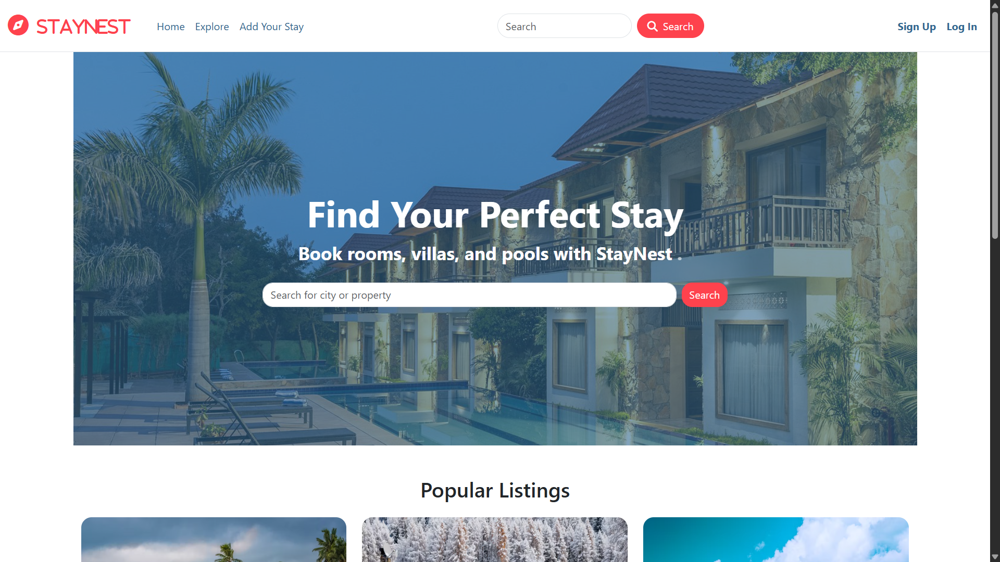
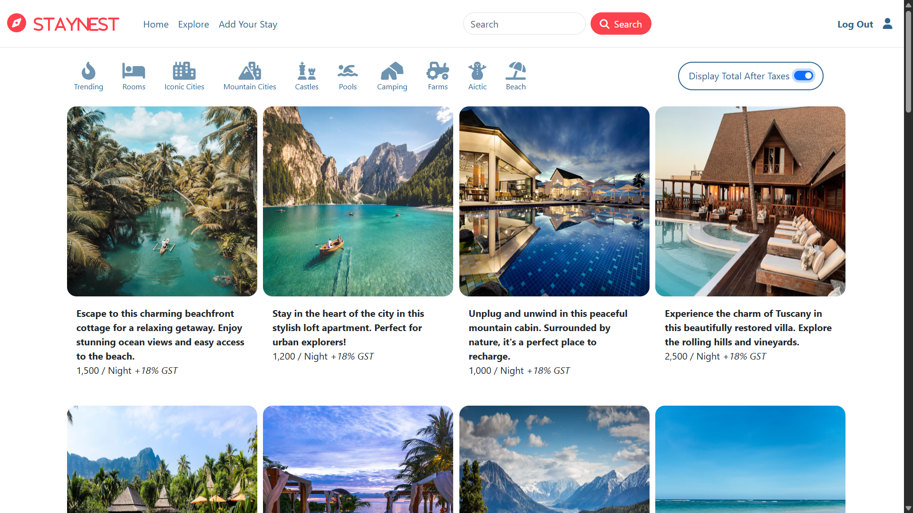
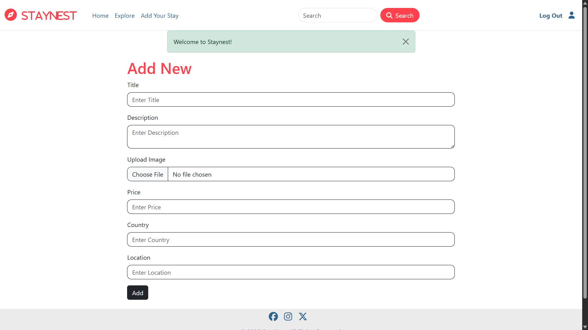
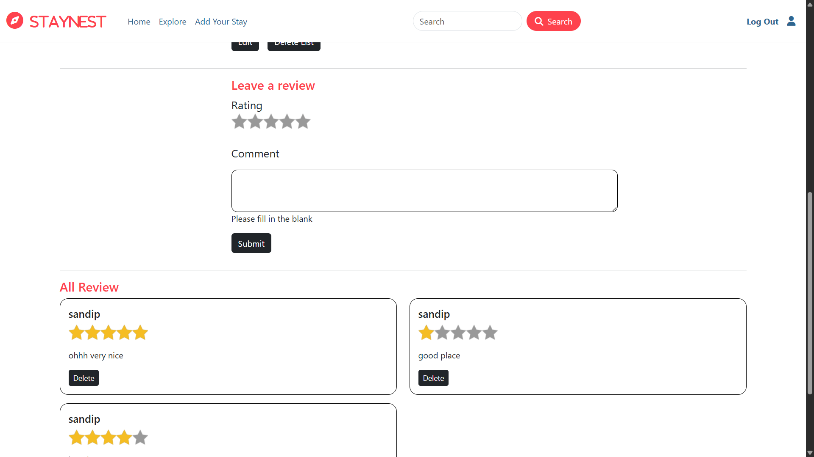
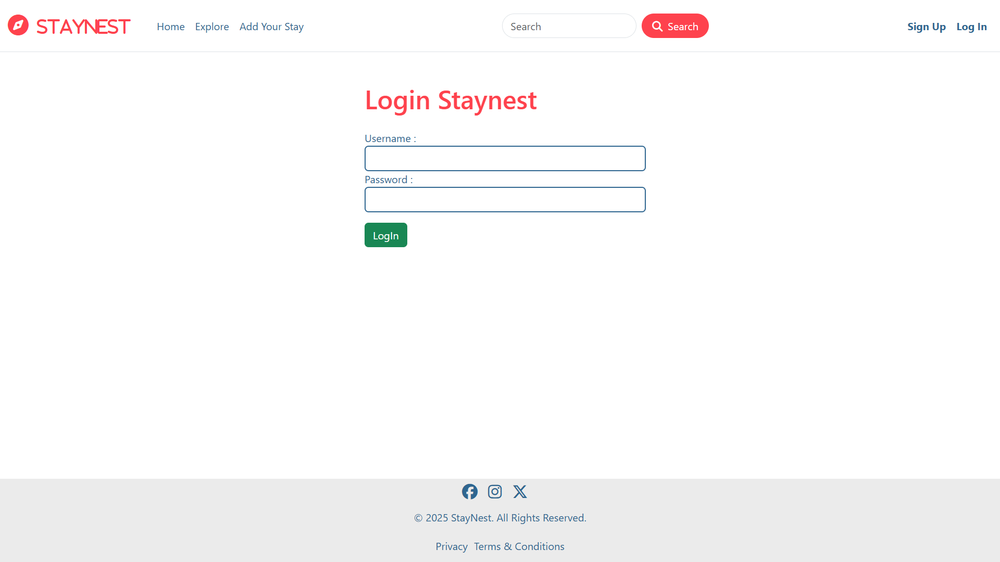
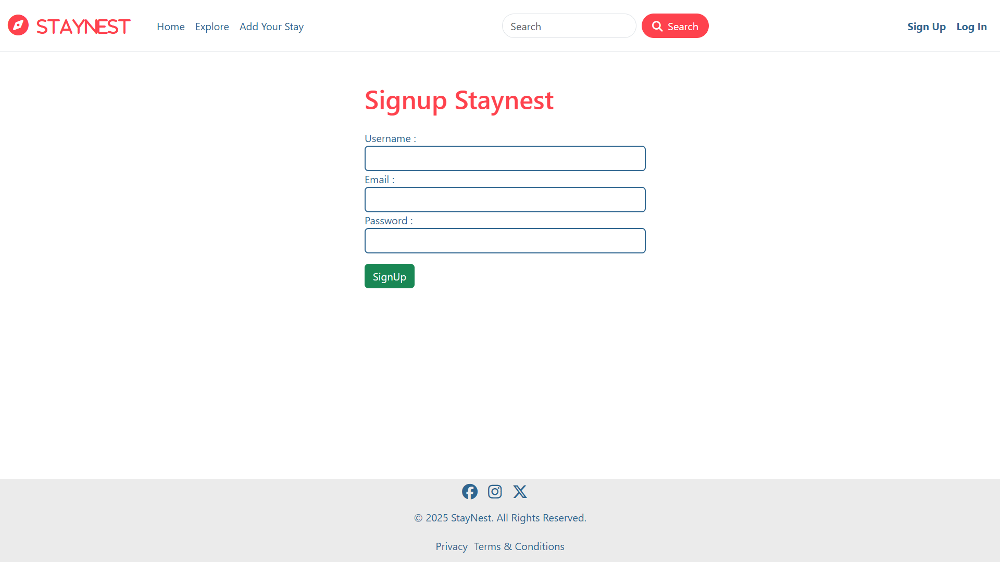
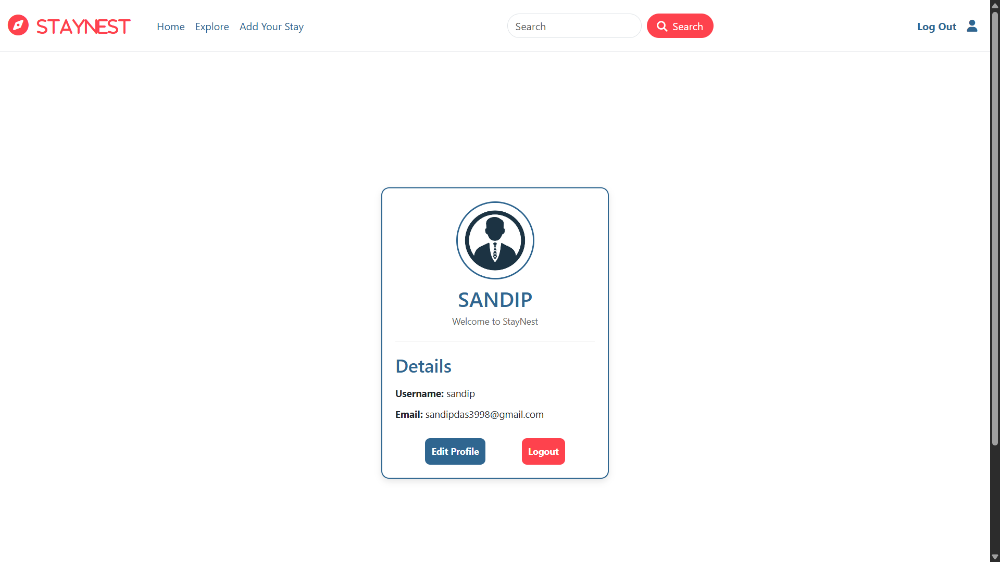

# STAYNEST – A Rental Platform


Hi, I’m **Sandip Das** 👋  

This is my project **Staynest**, a full-stack rental platform.Staynest is a full-stack web application that allows users to explore and manage rental properties such as homes, apartments, and vacation stays.  
Inspired by platforms like **Airbnb**, Staynest provides a seamless experience for both guests and hosts.

---

## 🚀 Features

- **User Authentication** – Secure login and registration.
- **Property Listings** – Add, view, edit, and delete property listings with images and detailed descriptions.
- **Search & Explore** – Browse through listings with ease.
- **Reviews & Ratings** – Share experiences by leaving reviews and ratings.
- **Responsive UI** – Clean, mobile-friendly, and responsive design.
- **Scalable Backend** – Built to support future enhancements.

---

## 🛠 Tech Stack

- **Frontend:** HTML, CSS, JavaScript, Bootstrap, Tailwind CSS
- **Backend:** Node.js, Express.js
- **Database:** MongoDB
- **Others:** RESTful APIs, EJS/Handlebars, MVC framework

---

## ⚙️ Installation & Setup

## ⚠️ Important Note (Environment Variables)

**This project does not include the `.env` file for security reasons.**  
Before running the application, you must create a `.env` file in the root directory with all required environment variables (e.g., database connection URL, API keys, secret keys).

### Required Environment Variables

| Variable Name               | Description                              |
|-----------------------------|------------------------------------------|
| `ATLASDB_URL`               | MongoDB connection string               |
| `SECRET`                    | Secret key for sessions/cookies         |
| `CLOUD_NAME`                | Cloudinary cloud name                   |
| `CLOUD_API_KEY`             | Cloudinary API key                      |
| `CLOUD_API_SECRET`          | Cloudinary API secret                   |
| `PORT`                      | Port number for running the server (e.g., 8080) |

Example of `.env` file:


1. **Clone the repository:**
   ```bash
   git clone https://github.com/your-username/staynest.git

2. **Navigate into the project folder:**
   ```bash
   cd staynest

3. **Install dependencies:**
   ```bash
   npm install

4. **Start the development server:**
   ```bash
   npm start
5. **Open your browser and go to:**
   ```bash
   http://localhost:8080

## 🖼 Screenshots

### 1. Home Page


### 2. Property Listings


### 3. Add / Edit Property


### 4. Reviews & Ratings


### 5. Login

   
### 6. Signup


### 7. Profile

